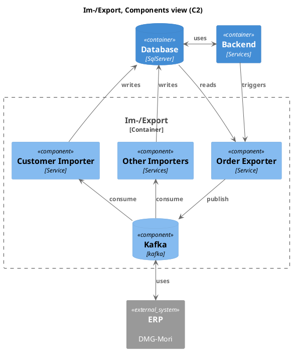
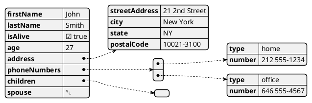
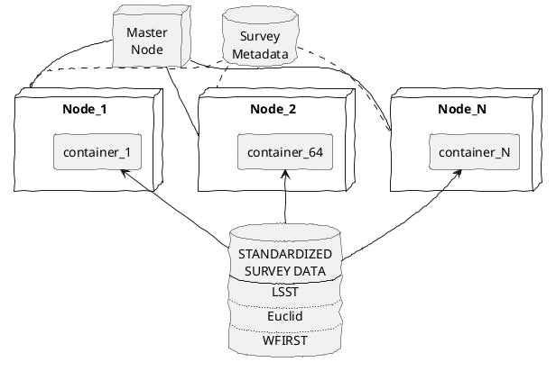
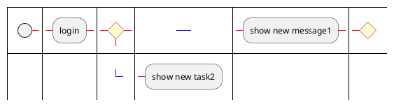
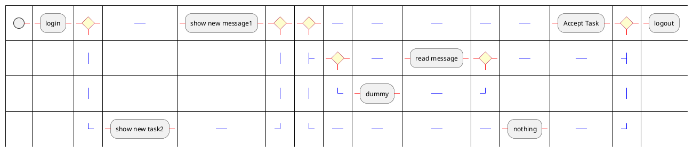

https://samizdat.dev/use-markdown-for-confluence/

# playground

Some examples are from https://real-world-plantuml.com/

[[_TOC_]]

In Markdown files you start a code section via triple-backticks. You can specify the type of the inline section, say `java`. But if you type it as `plantuml` is rendered on server and displayed as an image. This also works in your favrite IDE!

This is an example:

    ```plantuml
    Alice -> Bob: Authentication Request
    Bob --> Alice: Authentication Response
    ```

This renders as

```plantuml
Alice -> Bob: Authentication Request
Bob --> Alice: Authentication Response
```

----

## Sequence

Just draw Actors and Arrows and you get a Sequence Diagram:

    ```plantuml
    skinparam monochrome true
    Alice -> Bob: Authentication Request
    Bob --> Alice: Authentication Response
    ...


```plantuml
skinparam monochrome true
Alice -> Bob: Authentication Request
Bob --> Alice: Authentication Response
Alice -> Bob: Another authentication Request
Alice <-- Bob: another authentication Response
```


## Components

Component diagrams have `package` near the top.

    ```plantuml
    skinparam monochrome true
    skinparam componentStyle uml2
    package "ArduCopter - Simple Version" {
      [EnginesControl] -down-> Engines
      [EnginesControl] - [MainCopterProcess]
    ...

Oh, and you wonder about the colors, too? `skinparam` is [very important](https://www.embarc.de/drei-dinge-architekturdiagramme-plantuml-nerven/) for some...


```plantuml
skinparam monochrome true
skinparam componentStyle uml2
package "ArduCopter - Simple Version" {
  [EnginesControl] -down-> Engines
  [EnginesControl] - [MainCopterProcess]
  [MainCopterProcess] - [Rangefinder]
  [Rangefinder] -down-> BottomSonicSensor
  [MainCopterProcess] -down- [GPSSignalListener]
}
package "CarDuino Nano" {
  [GPSSignalMaker] -down- [MainCarDuinoProcess]
  [MainCarDuinoProcess] -down- [CommandListener]
  [GPSSignalMaker] -up- [GPSSignalSender]
  [MainCarDuinoProcess] - [5x Rangefinders]
  [5x Rangefinders] -down-> 5xSonicSensors
  [TelemetricsSender] - [MainCarDuinoProcess]
  [TelemetricsSender] -down- MiniUSB
  [CommandListener] -left- MiniUSB
}
package "Intell 2800 - Simple Version" {
  [ComputerCommunications] -up- USB
  [ComputerCommunications] - [MainComputerProcess]
  [KinectProcessing] -down-> KINECT
  [KinectProcessing] - [MainComputerProcess]
  [VideoProcessing] -down-> Camera
  [VideoProcessing] - [MainComputerProcess] 
  [ComputerCommunications2] -up- [MainComputerProcess]
  [ComputerCommunications2] -down- WiFi
  [ComputerCommunications2] -down- Bluetooth
}
[GPSSignalListener] -down- [GPSSignalSender]
USB -up- MiniUSB

```

## Classes

Class diagrams are recognized by the `class` keyword. 

    ```plantuml
    title DCP - Cahier des charges\n MOA : <b>obde</b> / MOE : <b>teamflat</b>
    class "Role" as role
    class "Adherent" as adherent
    ...


```plantuml

title DCP - Cahier des charges\n MOA : <b>obde</b> / MOE : <b>teamflat</b>
left to right direction
skinparam shadowing false

class "Role" as role
class "Adherent" as adherent
class "Materiel" as materiel
class "TypeMateriel" as type
class "Evenement" as evenement
class "Planning" as planning
class "Tache" as tache
class "Demande" as demande
class "Question" as question
class "SMSGroupe" as sms

evenement "1" -- "0..1" planning
evenement "1" -- "0..*" adherent
tache "1..*" -- "1" planning
tache "0..*" -- "0..*" adherent
role "0..1" -- "0..*" adherent
question "0..*" -- "1" adherent
sms "1..*" -- "0..*" adherent
role "0..*" -- "0..1" role : dirige
demande "0..*" - "1" evenement
adherent "0..*" - "1" demande
type "0..*" - "1" materiel
demande "1" - "0..*" materiel

```

## C4model

See [puml HHG](https://crashedmind.github.io/PlantUMLHitchhikersGuide/C4/C4Stdlib.html)
and [architecture as code](https://lukemerrett.com/c4-diagrams-as-code-architectural-joy/)
based on [C4Model](https://c4model.com/) 
and overkill in [C4 PlantUml Stdlib](https://github.com/plantuml-stdlib/C4-PlantUML)

You `!include` parts of the *PlantUML Standard Library* and use `Container`, `Component` etc in your diagrams.

    ```plantuml
    @startuml(id=imexp)
    !include <C4/C4.puml>
    !include <C4/C4_Context.puml>

    title Im-/Export, Components view (C2)

    Container(be, "Backend", "Services")
    ContainerDb(db, "Database", "SqlServer")
    Container_Boundary(3_boundary, "Im-/Export") {
      Component(order_exporter, "Order Exporter", "Service")
    ...




## JSON

If you find a graphical represenation of a JSON structure useful, you can do it:

    ```plantuml
    @startjson
    {
      "firstName": "John",
      "lastName": "Smith",
    ...





## Font Awesome as Icons

The PlantUML StdLib also includes the "tupadr3" parts, sou you can use the *Sprites* fo show all (?) FontAwesome icons:

    ` ` `plantuml
    @startuml

    !include <tupadr3/common>
    !include <tupadr3/font-awesome/battery_0>
    !include <tupadr3/font-awesome/battery_2>
    !include <tupadr3/font-awesome/battery_4>

    rectangle empty as "Empty <$battery_0*0.4>"  #orange
    rectangle half  as "Half  <$battery_2*0.6>"  #yellow
    rectangle full  as "Full  <$battery_4*0.8>"  #lightgreen

    empty -> half
    half -> full
        
    @enduml
    ` ` `

As you can see, you will

 * use the `!include <tupadr3/font-awesome/icon_name>` directive
 * include the sprite anywhere with `<$icon_name>`
 * scaling it with `<$icon_name*scale>` or `<$icon_name{scale=...}>`

```plantuml
@startuml

!include <tupadr3/common>
!include <tupadr3/font-awesome/battery_0>
!include <tupadr3/font-awesome/battery_2>
!include <tupadr3/font-awesome/battery_4>

rectangle empty as "Empty <$battery_0*0.4>"  #orange
rectangle half  as "Half  <$battery_2*0.6>"  #yellow
rectangle full  as "Full  <$battery_4*0.8>"  #lightgreen

empty -> half
half -> full
    
@enduml
```




The complete list of [FontAwesome4](https://github.com/tupadr3/plantuml-icon-font-sprites/blob/master/font-awesome/index.md) and [FA5](https://github.com/tupadr3/plantuml-icon-font-sprites/blob/master/font-awesome-5/index.md) can be seen online.
For your convenience I generated a list of all [FontAwesome5](font-awsome-5.md) icons included in my
current IntelliJ with in a Markdown-file with PlantUML.

But [Tupadr3](https://github.com/tupadr3/plantuml-icon-font-sprites) defines a lot of other sprites as well.

Since recently you don't have to include external content with `!includeurl`, it's now builtin and you can use `!include <tupadr3/...>`.


## Draft Style (xkcd)

see http://nrstickley.com/log/2019/01/22/

The magix lies in the `skinparam`s:

    ```plantuml
    @startuml  
    skinparam handwritten true
    skinparam DefaultFontName xkcd Script
    ...




## GraphViz

As a bonus PlantUML can use *dot* as an input language and the automatic layout system of *GraphViz*. 
GraphViz is one of the oldest de-facto standard when it comes to textual graph representations.

If you already know the syntax, all you have to tell PlantUML is `digraph`:

    ```plantuml
    digraph G {
      concentrate=True;
      rankdir=TB;
      node [shape=record];
      140087530674552 [label="title: InputLayer\n|{input:|output:}|{{[(?, ?)]}|{[(?, ?)]}}"];
      140087537895856 [label="body: InputLayer\n|{input:|output:}|{{[(?, ?)]}|{[(?, ?)]}}"];
    ...


```plantuml
digraph G {
  concentrate=True;
  rankdir=TB;
  node [shape=record];
  140087530674552 [label="title: InputLayer\n|{input:|output:}|{{[(?, ?)]}|{[(?, ?)]}}"];
  140087537895856 [label="body: InputLayer\n|{input:|output:}|{{[(?, ?)]}|{[(?, ?)]}}"];
  140087531105640 [label="embedding_2: Embedding\n|{input:|output:}|{{(?, ?)}|{(?, ?, 64)}}"];
  140087530711024 [label="embedding_3: Embedding\n|{input:|output:}|{{(?, ?)}|{(?, ?, 64)}}"];
  140087537980360 [label="lstm_2: LSTM\n|{input:|output:}|{{(?, ?, 64)}|{(?, 128)}}"];
  140087531256464 [label="lstm_3: LSTM\n|{input:|output:}|{{(?, ?, 64)}|{(?, 32)}}"];
  140087531106200 [label="tags: InputLayer\n|{input:|output:}|{{[(?, 12)]}|{[(?, 12)]}}"];
  140087530348048 [label="concatenate_1: Concatenate\n|{input:|output:}|{{[(?, 128), (?, 32), (?, 12)]}|{(?, 172)}}"];
  140087530347992 [label="priority: Dense\n|{input:|output:}|{{(?, 172)}|{(?, 1)}}"];
  140087530711304 [label="department: Dense\n|{input:|output:}|{{(?, 172)}|{(?, 4)}}"];
  140087530674552 -> 140087531105640;
  140087537895856 -> 140087530711024;
  140087531105640 -> 140087537980360;
  140087530711024 -> 140087531256464;
  140087537980360 -> 140087530348048;
  140087531256464 -> 140087530348048;
  140087531106200 -> 140087530348048;
  140087530348048 -> 140087530347992;
  140087530348048 -> 140087530711304;
}
```

## BPNM

...seems to be beta, alas.

    ` ` `plantuml
    @startbpm
    :login;
    20:<+>
    :show new message1;
    30:<+>
    resume 20
    :show new task2;
    @endbpm
    ` ` `



----

    ` ` `plantuml
    @startbpm
    :login;
    new branch
    :show new message1;
    else
    :show new task2;
    end branch
    new branch
    :Accept Task;
    else
    :nothing;
    else
    new branch
    :read message;
    else
    :dummy;
    end branch
    end branch
    :logout;
    @endbpm
    ` ` `


