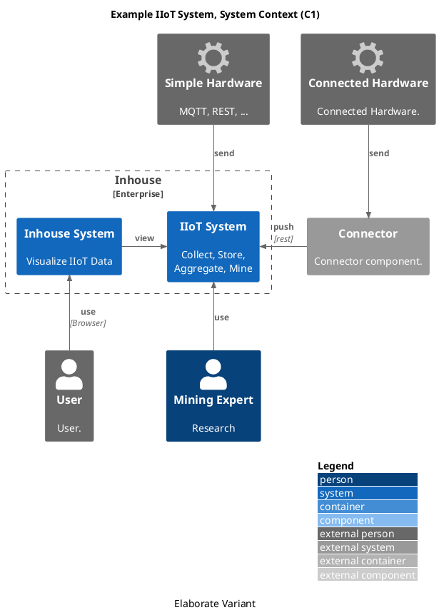

Lorem ipsum dolor sit amet, consectetur adipiscing elit. Sed non risus. Suspendisse lectus tortor, dignissim sit amet, adipiscing nec, ultricies sed, dolor.


```plantuml
"%version() " as b
version -> b
```


this here is a test that uses `Person_ext()` and an `office/Concepts/settings`-symbol.


