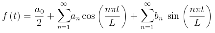
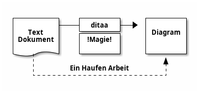
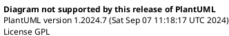
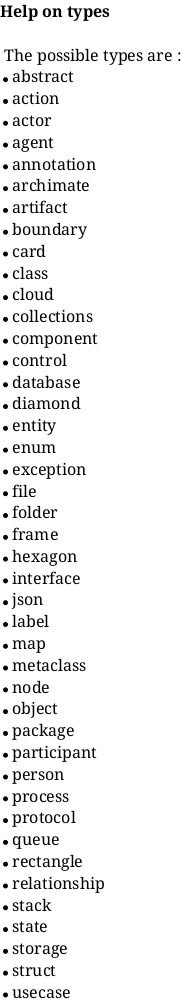
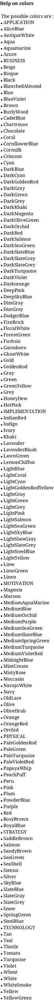
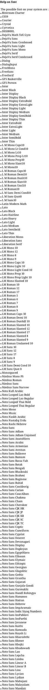

# Experimental

## @startgit

    ```plantuml
    @startgit
     * git
    @endgit
```




```plantuml
@startgit
 * git
@endgit
```

## @startmath

Probably needs a LaTeX installation, I suppose.

    ```plantuml
    @startmath
    f(t)=(a_0)/2 + sum_(n=1)^ooa_ncos((npit)/L)+sum_(n=1)^oo b_n\ sin((npit)/L) 
    @endmath
    ```



## @startlatex

Definitely needs a LaTeX installation.

    ```plantuml
    @startlatex
    \documentclass{standalone}
    \begin{document}
      Hello world!
    \end{document}
    @endlatex
    ```



```plantuml
@startlatex
\documentclass{standalone}
\begin{document}
  Hello world!
\end{document}
@endlatex
```

## @startjcckit

Nice, simple, not that pretty in here, but could be useful.

    ```plantuml
    @startjcckit (200,140)
    jcckit
    data/curves = curve1
    data/curve1/x = 0.1 0.5 0.9
    data/curve1/y = 0.1 0.8 0.9
    plot/coordinateSystem/xAxis/axisLabel = jcckit
    plot/coordinateSystem/xAxis/automaticTicCalculation = false
    plot/coordinateSystem/xAxis/numberOfTics = 4
    plot/coordinateSystem/yAxis/axisLabel =
    plot/coordinateSystem/yAxis/automaticTicCalculation = false
    plot/coordinateSystem/yAxis/numberOfTics = 4
    plot/legendVisible = false
    @endjcckit
    ```

Look [there](http://jcckit.sourceforge.net/examples.html).

```plantuml
@startjcckit (200,140)
jcckit
data/curves = curve1
data/curve1/x = 0.1 0.5 0.9
data/curve1/y = 0.1 0.8 0.9
plot/coordinateSystem/xAxis/axisLabel = jcckit
plot/coordinateSystem/xAxis/automaticTicCalculation = false
plot/coordinateSystem/xAxis/numberOfTics = 4
plot/coordinateSystem/yAxis/axisLabel =
plot/coordinateSystem/yAxis/automaticTicCalculation = false
plot/coordinateSystem/yAxis/numberOfTics = 4
plot/legendVisible = false
@endjcckit
```



But:

> JCCKit V1.1
> 
> This is a major release from 12/18/2004.

You might don't want to go there...


## @startboard

    ```plantuml
    @startboard
    board
    @endboard
    ```


## @startditaa

    ```plantuml
    @startditaa
    +--------+   +-------+    +-------+
    |        +---+ ditaa +--> |       |
    |  Text  |   +-------+    |Diagram|
    |Dokument|   |!Magie!|    |       |
    |     {d}|   |       |    |       |
    +---+----+   +-------+    +-------+
        :                         ^
        |    Ein Haufen Arbeit    |
        +-------------------------+
    @endditaa
    ```



## @startgantt

    ```plantuml
    @startgantt
    [gantt] lasts 5 days
    @endgantt
    ```



```plantuml
@startgantt
[gantt] lasts 5 days
@endgantt
```

## @startdef
    
    ```plantuml
    @startdef
    adef
    @enddef
    ```


## @startproject
    
    ```plantuml
    @startproject
    proj
    @endproject
    ```




## help

Help

```plantuml
@startuml
help
@enduml
```

---

types



---

colors



---

font




