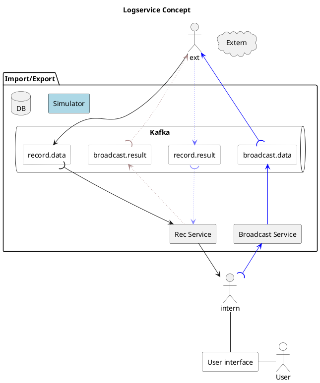

# Example Logservice Concept

Lorem ipsum dolor sit amet consectetuer adipiscing elit sed diam nonummy nibh euismod tincidunt ut la
lore magna aliquam erat volutpat. Ut wisi enim ad minim veniam quis nostrud exerci tation ullamcorper

 * Lorem ipsum dolor sit amet consectetuer adipiscing elit sed diam nonummy nibh euismod tincidunt ut laoreet dolore magna aliquam erat volutpat
 * Sed diam voluptua At vero eos et accusam et justo duo dolores et ea rebum Stet clita kasd gubergren no sea takimata sanctus est Lorem ipsum dolor sit amet
