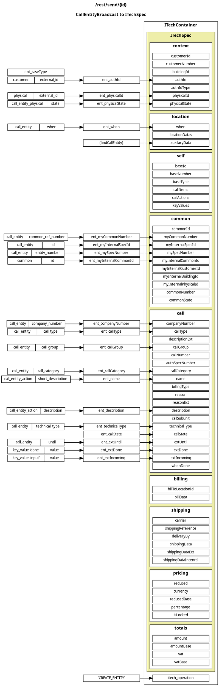

# Mapping

## entity initialBroadcast

```plantuml
@startuml
digraph map {
    rankdir="LR" bgcolor = "#ffffff"; fontsize=12; fontname="sans bold";
    nodesep=0.03;
    node[shape=record,fontname="sans",fontsize=10,width=2.2,height=0.1,labeljust=l];
    
    labelloc="t";
    label = "/rest/send/{id}\n\nCallEntityBroadcast to ITechSpec";

  subgraph group_CallEntityBroadcast { 
            bgcolor = "#ffffff"; label="CallEntityBroadcast";
        ent_myInternalCommonId;
        ent_myCommonNumber;
        ent_myInternalSpecId;
        ent_mySpecNumber;
        ent_authId;
        ent_physicalId;
        ent_companyNumber;
        ent_callType;
        ent_callGroup;
        ent_callCategory;
        ent_physicalState;
        ent_when;
        ent_name;
        ent_description;
        ent_technicalType;
        ent_caseType;
        ent_callState;
  }


subgraph cluster_itech_message {
        bgcolor = "#ffffff"; label="ITechContainer";
itech_operation;

  subgraph cluster_ITechSpec { 
        bgcolor = "#eeeeaa"; label="ITechSpec";

    subgraph cluster_self { 
            bgcolor = "#ffffff"; label="self";
        baseId;
        baseNumber;
        baseType;
        
        callItems[javaclass="List<ITechSpecItem>"];
        callActions[javaclass="List<ITechSpecAction>"];
        keyValues[javaclass="List<ITechKeyValue>"];
    }
    
    subgraph cluster_common_info {
            bgcolor = "#ffffff"; label="common";
        commonId;
        myInternalCommonId;
        myCommonNumber;
        myInternalSpecId;
        mySpecNumber;
        myInternalCustomerId;
        myInternalBuildingId;
        myInternalPhysicalId;
        commonNumber;
        commonState;
    }    

    subgraph cluster_context {
            bgcolor = "#ffffff"; label="context";
        customerId;
        customerNumber;
        buildingId;
        authId;
        authIdType;
        physicalId;
        physicalState;
    }
    
    subgraph cluster_location {
            bgcolor = "#ffffff"; label="location";
	    auxilaryData [javaclass=ITechAuxilary];
	    locationDatas [javaclass="List<ITechAccount>"];
        when[javaclass=LocalDateTime];
    }    
        
    subgraph cluster_call_info {
            bgcolor = "#ffffff"; label="call";
	    name;
	    description;
	    descriptionExt;
	    technicalType;
	    callNumber;
	    authSpecNumber;
	    callGroup;
	    callCategory;
        billingType;
        reason;
        reasonExt;
        companyNumber;
        callSubunit;
	    callType;
	    callState;
	    extUntil;
	    extDone;
	    extIncoming;
	    whenDone;
    }    
        
    subgraph cluster_billing {
            bgcolor = "#ffffff"; label="billing";
	    billToLocationId;
	    billData;
    }    
        
    subgraph cluster_shipping {
            bgcolor = "#ffffff"; label="shipping";
	    carrier;
	    shippingReference;
	    deliveryBy;
	    shippingData;
	    shippingDataExt;
	    shippingDataIntenral;
    }    
        
    subgraph cluster_pricing {
            bgcolor = "#ffffff"; label="pricing";
	    reduced;
	    currency;
	    reducedBase;
	    percentage;
	    isLocked;
    }    
        
    subgraph cluster_totals {
            bgcolor = "#ffffff"; label="totals";
	    amount;
	    amountBase;
	    reduced;
	    reducedBase;
	    vat;
	    vatBase;
    }    
        
  }     

}
  

  
    // db
  
    subgraph group_st {
        st_call_entity_id [label="{call_entity|id}"];
        st_common_id [label="{common|id}"];
        st_call_entity_common_ref_number [label="{call_entity|common_ref_number}"];
        st_call_entity_entity_number [label="{call_entity|entity_number}"];
        st_customer_external_id [label="{customer|external_id}"];
        st_physical_external_id [label="{physical|external_id}"];
        st_call_entity_company_number [label="{call_entity|company_number}"];
        st_call_entity_type [label="{call_entity|call_type}"];
        st_call_entity_group [label="{call_entity|call_group}"];
        st_call_entity_category [label="{call_entity|call_category}"];
        st_call_entity_when [label="{call_entity|when}"];
        st_call_entity_technical_type [label="{call_entity|technical_type}"];
        st_call_entity_until [label="{call_entity|until}"];
        st_call_entity_physical_state [label="{call_entity_physical|state}"];
        st_call_entity_name [label="{call_entity_action|short_description}"];
        st_call_entity_action_description [label="{call_entity_action|description}"];
        st_key_value_done [label="{key_value 'done'|value}"];
        st_key_value_input [label="{key_value 'input'|value}"];
    }
   
    st_call_entity_id -> ent_myInternalSpecId;
    st_common_id -> ent_myInternalCommonId;
    st_call_entity_common_ref_number -> ent_myCommonNumber;
    st_call_entity_entity_number -> ent_mySpecNumber;
    st_customer_external_id -> ent_authId ;
    st_physical_external_id -> ent_physicalId ;
    st_call_entity_company_number -> ent_companyNumber;
    st_call_entity_type -> ent_callType;
    st_call_entity_group -> ent_callGroup;
    st_call_entity_category -> ent_callCategory;
    st_call_entity_when -> ent_when;
    st_call_entity_technical_type -> ent_technicalType;
    st_call_entity_until -> ent_extUntil ;
    st_call_entity_physical_state -> ent_physicalState;
    st_call_entity_name -> ent_name;
    st_call_entity_action_description -> ent_description;
    st_key_value_done -> ent_extDone;
    st_key_value_input -> ent_extIncoming ;
    

    // edges
    
    ent_myInternalCommonId -> myInternalCommonId;
    ent_myCommonNumber -> myCommonNumber ;
    ent_myInternalSpecId -> myInternalSpecId ; 
    ent_mySpecNumber -> mySpecNumber ;
    ent_authId -> authId ;
    ent_physicalId -> physicalId ;
    ent_companyNumber -> companyNumber ;
    ent_callType -> callType ;
    ent_callGroup -> callGroup ;
    ent_callCategory -> callCategory ;
    ent_physicalState -> physicalState ;
    ent_when -> when ;
    ent_name -> name ;
    ent_description -> description ;
    ent_technicalType -> technicalType ;
    ent_callState -> callState ;
    ent_extUntil -> extUntil ;
    ent_extDone -> extDone ;
    ent_extIncoming -> extIncoming ;
    
    dummy_1 [label="(findCallEntity)"];
    dummy_1 -> auxilaryData;
  

    dummy_2 [label="'CREATE_ENTITY'"];
    dummy_2 -> itech_operation;
  
}
@enduml
```
