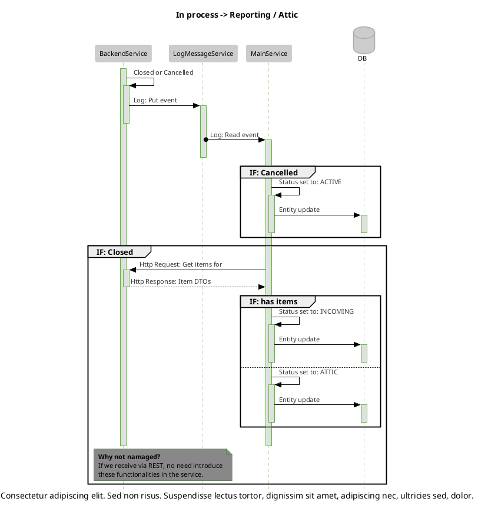

# A practical PlantUML demo

Lorem ipsum dolor sit amet, consectetur adipiscing elit. Sed non risus. Suspendisse lectus tortor, dignissim sit amet, adipiscing nec, ultricies sed, dolor.

```plantuml
@startuml

title In process -> Reporting / Attic
caption Consectetur adipiscing elit. Sed non risus. Suspendisse lectus tortor, dignissim sit amet, adipiscing nec, ultricies sed, dolor.

' A choice of acceptable themes. should print well: non-gradient, high contrast, light (not dark),    
'!theme bluegray
'!theme cerulean
'!theme plain
'!theme sketchy-outline
!theme reddress-lightgreen

skinparam BackgroundColor white
' dont repeat participants at bottom, make arrow heads triangular, remove shadows:
skinparam style strictuml


' =============================

participant BackendService as bs
participant LogMessageService as rs
participant MainService as ts
database DB as db

autoactivate on
activate bs

bs -> bs : Closed or Cancelled
bs -> rs ++-- : Log: Put event
rs o-> ts ++--: Log: Read event

group IF: Cancelled
    ts -> ts ++: Status set to: ACTIVE
    ts -> db ++--: Entity update
    deactivate db
end

group IF: Closed

    ts -> bs : Http Request: Get items for 
    ts <-- bs : Http Response: Item DTOs

    group IF: has items  
        ts -> ts  : Status set to: INCOMING
        ts -> db ++--: Entity update
        deactivate db
    else    
        ts -> ts : Status set to: ATTIC
        ts -> db ++--: Entity update
        deactivate db
    end

      |||
      deactivate ts
      deactivate bs

  / note over bs, rs #888888
    **Why not namaged?**
    If we receive via REST, no need introduce
    these functionalities in the service.
  end note
    
end

@enduml
```
