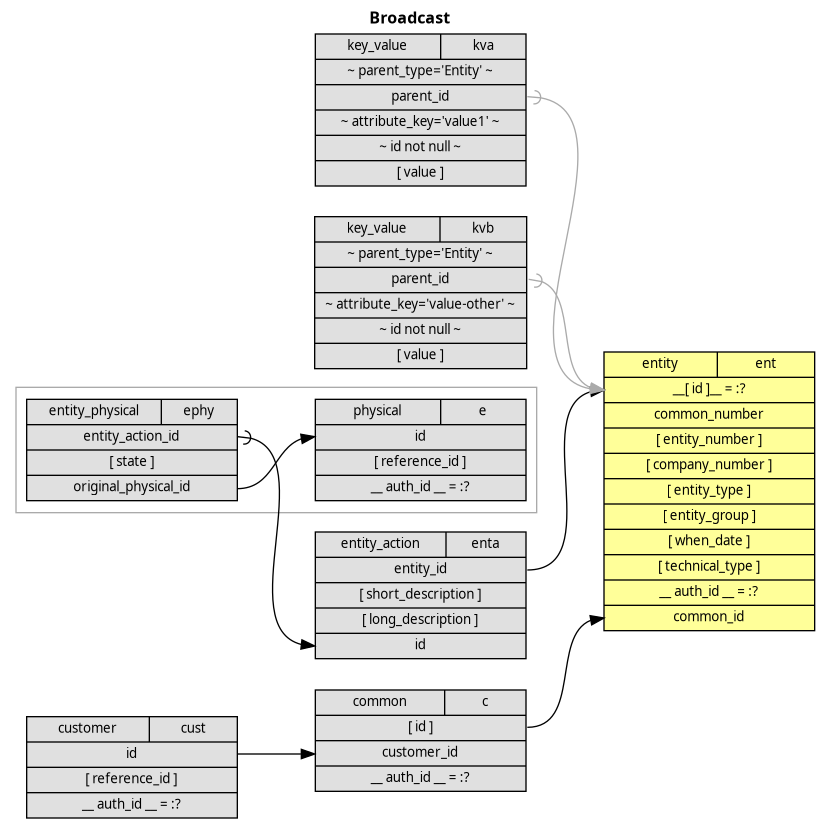

# Broadcast

## Visualization of SQL

### Legend Key
 
 * top row of node/box shows the table name and its alias 
 * `__ input_field __= :?` -- and input field, probably set via a prepared query
 * `[ output_field ] ` -- field passed to outside via the outermost select clause
 * `~ field_with = filter ~` -- inner filter in a where clause
 * arrows are joins
 * circle-arrows are outer joins
 * boxes are subqueries (eg, to realize outer joins over multiple tables)
 * colored backgrounds on nodes/boxes and arrows just (de)emphasize

