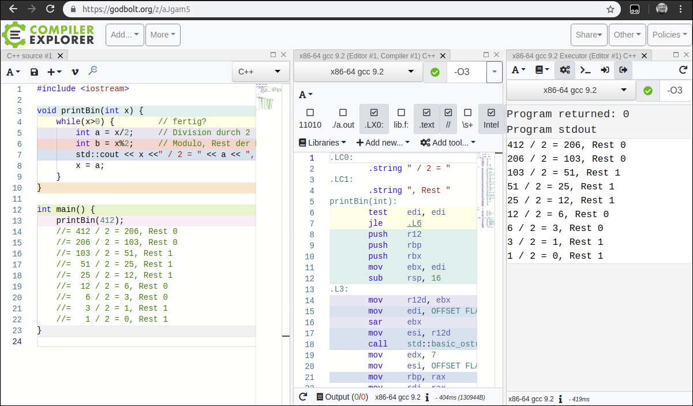

# Vorwort

Wir schreiben das Jahr 2020.
Der mit C++11 eingeführte »moderne C++-Stil« hat sich durchgesetzt, und
auf breiter Front wird C++17 genutzt. Dementsprechend finden Sie in diesem Buch
`string_view`, `if constexpr`, Erweiterungen bei den Standardcontainern und Algorithmen und
vieles mehr. Insbesondere die Beispiele sind, sofern sinnvoll, in der neuen
Template-Parameter-Deduktion gehalten: `vector{1,2,3}` statt `vector<int>{1,2,3}`.
Auch das strukturierte Binden sehen Sie ab und zu, also das Deklarieren
mehrerer Variablen anhand eines Initialisierungsausdrucks wie `auto [a,b] = pair{1,2}`.

Die aktuellste Version der Sprache heißt C++20, ist aber -- Stand Februar -- noch nicht abgesegnet.
Im vorliegenden Buch präsentiere ich Ihnen Features, die mit nahezu an Sicherheit grenzender
Wahrscheinlichkeit Teil des offiziellen Standards sein werden. Ich bespreche Module ebenso wie sofortige Funktionen und
den `<=>`-Operator. Auch einige Änderungen in der Standardbibliothek erwähne ich. Features, die sich auf C++20
beziehen, hebe ich aber als solche hervor, entweder mit einem Balken und »C++20« im Titel oder
`('unterpunktet')` im Code.

Auf einige Dinge von C++20 gehe ich jedoch bewusst nicht ein: Module und Coroutinen bespreche
ich nur oberflächlich. Und die lang erwarteten Concepts als Metasprache über Templates
bespreche ich gar nicht. Das hat mehrere Gründe: Erstens sind diese Features so umwälzend und
zugleich so jung, dass noch niemand eine definitive »Best Practice« dafür bereitstellen kann.
Vieles wird sich erst in den nächsten Jahren aus der täglichen Arbeit der
Entwickler mit diesen Features ergeben.
Zweitens sind sie groß und komplex. Sie würden einfach
den Rahmen dieses Buchs sprengen. Ich würde Ihnen vielleicht vieles präsentieren, was sich
letztendlich in der Praxis als zu selten eingesetzt herausgestellt, und hätte Mühe, Papier und Ihre
Geduld verschwendet.
Und drittens ist es in Moment unmöglich, einen Compiler zu finden,
der zuverlässig alle C++-20-Features schon unterstützt. Einzelne ja, mal so, mal der, aber alle
gemeinsam nicht.
Ich verspreche aber, mich der Sache in einer kommenden Auflage noch einmal
anzunehmen -- dann, wenn auch die Überarbeitung des Qt-Kapitels ansteht.

Bleibt noch, mich für das viele positive Feedback zu bedanken, das ich erhalten habe,
und ebenso für die konstruktive Kritik. Ein Punkt war, dass die Listings der 1.°Auflage zwar als Download
verfügbar waren, sich aber aus mehrerlei Gründen schwer darin zurechtzufinden sei. Und weil
wir im Jahr 2020 angekommen sind -- Bogen zum einleitenden Satz geschlossen --, sind nun die
Listings einzeln und interaktiv für Sie zum Ausprobieren online. Über den meisten
Listings finden Sie einen Link zum *Compiler-Explorer* von Matt Godbolt, **https://godbolt.org/z/...**, der
Sie direkt zu dem entsprechenden Listing bringt.

Damit nicht genug: Das Listing wurde dort schon kompiliert und
ausgeführt. Sie sehen die Compilermeldungen und die Programmausgaben. But wait, there is more:
Sie können direkt im Browser mit dem Quellcode herumspielen und sogar zwischen
verschiedenen Compilern umschalten. Einen herzlichen Dank an Matt Godbolt, der mir freundlicherweise erlaubt hat,
seinen exzellenten Service für dieses Buch zu nutzen.

Nun wünsche ich Ihnen viel Erfolg bei den Studien des aktuellen C++.

Mai 2020, Bielefeld

*Torsten T. Will*

# Vorwort zur 1. Auflage

C++ ist eine moderne Programmiersprache. Wenn man sie
richtig benutzt. Dieses Handbuch soll Ihnen dabei helfen, in
C++ so zu programmieren, dass Sie von dem Programm auch in
vielen Jahren noch etwas haben -- dass Ihr Programm **nachhaltig**
ist.

Aber selbstverständlich spricht nichts dagegen, wenn Sie Ihr
Programm »traditionell« schreiben. Das heißt, kurz
zusammengefasst, für mich, dass Ihr Programm mehr nach C
aussieht, als es aussehen könnte. Daran ist nichts falsch, natürlich nicht.
Einige der besten Programme sind in C geschrieben. Dennoch,
wenn Sie **heute** ein Projekt beginnen und sich für eine
in Maschinencode übersetzte Programmiersprache entscheiden,
dann nehmen Sie doch besser C++. Denn in der Sprache
tut sich etwas -- oder besser, hat sich was getan. Sie haben
mit C++14 (und ganz frisch C++17) eine Sprache, die Sie auf
aktuelle Art und Weise darin unterstützt, **gute** Programme
zu schreiben. Das heißt, Ihre Programme sind schnell, fehlerresistent,
wartbar. Sie können produktiv programmieren.

Für dieses Buch habe ich lange überlegt, wie man C++ am besten vermittelt.
Bjarne Stroustrup hat auf der C++Con 2017 eine Keynote gehalten, die genau dieses
Thema zum Kern hatte. Und er sagte dort Dinge, die, so finde ich, weltbewegend sind. Zumindest, was die
C++-Welt angeht. Denn er sagte: »Wir (Lehrenden) haben bis C++98 schlechte darin Arbeit geleistet, Menschen
C++ beizubringen.« Und er habe sich Gedanken gemacht, warum das so war. Er schließt sich dabei mit ein und
resümiert, dass die meisten C++-Bücher lang, eintönig und langsam sind. Sie brächten »bottom-up 1990-C++« bei
und benutzten dabei C++11-Syntax. Und das sei verkehrt.  Nun habe ich dieses Buch zu schreiben begonnen,
lange bevor Bjarne Stroustrup diese Keynote gehalten hat. Und gerade deshalb fühle ich mich im ausklingenden Jahr 2017 in der Art und
Weise, wie dieses Buch am Ende des Arbeitsprozesses nun aussieht, bestätigt.
Denn ich sehe das genauso und habe mich von Grund auf bemüht, es anders zu machen.

Zum Beispiel werden Sie in diesem Buch Zeiger erst weit hinten erklärt bekommen. Das ist ziemlich gewagt.
Zeiger sind wichtig, in C++ dreht sich vieles um Adressen -- aber seit C++11 eben nicht alles. Viel
wichtiger ist es, das Konzept hinter Zeigern zu verstehen, manifestiert in Iteratoren. Denn wenn man den
Mechanismus versteht, kann man das Detail mit anderen Dingen kombinieren und Neues erschaffen.
Ich möchte immer das Warum in den Vordergrund gestellt sehen.

Stroustrup sagt in seiner Keynote, dass das neue C++ unter anderem Ressourcensicherheit in den Vordergrund
stelle. Er fragt danach, welches Buch RAII deswegen in den Vordergrund stelle? Es seien wenige. Der Begriff RAII wird Ihnen
in diesem Buch mehrmals begegnen. Er kritisiert, dass viele Bücher Typsicherheit, Abstraktion, Klassendesign und
generische Programmierung nicht einmal erwähnen. Dieses Buch tut es.

Mir sind aber auch Genauigkeit und Sorgfalt wichtig, und darum gibt es hier ebenfalls einen eher technischen
Teil, der sich um Syntax und Semantik der kleinen und großen C++-Konstrukte kümmert. Diese kann man in einem
Handbuch nicht überspringen. In einem einzelnen Projekt reicht es vielleicht, eine einzelne Regel dazu zu kennen, welche
Defaultoperationen man für eine Klasse definieren sollte. In einer Architektur und für das Verständnis des
Warums muss man aber wissen, welche Defaultoperationen es gibt und wie sie miteinander interagieren.
Mein Ansatz ist daher, dass ich Ihnen die Dinge in drei Bissgrößen vermittle: Der erste Überblick
ist in wenigen Seiten erledigt und gibt Ihnen das erste Gefühl für ein C++-Programm. Es folgt die größere
Schleife, in der ich auf nahezu jedes Sprachelement kurz eingehe, damit Sie die Interaktionen verstehen: Sie
lernen Ausdrücke, Typen, Anweisungen, Variablen und die Standardbibliothek kennen. Erst in der dritten Runde
gehe ich in einzelnen Kapiteln auf alle diese Elemente im Detail ein. Dort finden Sie die Dinge mit
Hintergrund und Interaktion mit der Welt erklärt: Bits, Bytes, Big-Endian, Fließkommaformate, Exceptions,
Klassen und so weiter und so fort.

Besonders am Herzen liegen mir dabei die Kapitel über `vector`, `map` und Konsorten -- also das Thema Container.
Die
Container der Standardbibliothek werden unterschätzt und durchweg zu wenig eingesetzt. Warum? Zurück zu
Bjarne: Weil wir es nicht gut genug vermittelt haben. Ich bemühe mich hier um einen anderen Ansatz. Statt nur
aufzuzählen, welche Container es gibt und was für Schnittstellen und Eigenschaften sie haben,
möchte ich Ihre Aufmerksamkeit mehr die Konzepte lenken, besonders aus die Gemeinsamkeiten und Unterschiede
zwischen den Containern. Sie sollen sich nicht von
Beginn an alle Methoden von `vector` merken, sondern, was die
Container können, was sie nicht können und wann Sie welchen wählen sollten. Und genau zu Letzterem habe ich
deshalb noch ein eigenes Kapitel geschrieben. Wenn ein Problem gegeben ist, können Sie mit einer Referenz doch nur
**dann** den richtigen Container finden, wenn Sie alle Containerbeschreibungen gelesen und verinnerlicht haben.
Ich beschreibe also typische Probleme und stelle Ihnen Kriterien vor, nach denen Sie die passenden
Container auswählen können.

Und das stellt mich immer noch nicht zufrieden. Wer C++ kann, kann nicht automatisch programmieren. Wer
das neue C++ aber richtig anwendet, hat verstanden, worum es geht. Und weil »worum es geht« nicht nur in
C++ wichtig ist, sondern auch in anderen Programmiersprachen, war es mir wichtig, dass Sie auch über den
Tellerrand hinausschauen. Die eingestreuten Dan-Kapitel beschäftigen sich mit Dingen, die überall in der Softwareentwicklung
vorkommen. Egal, ob Sie in Java, PHP oder SQL programmieren. Sie müssen testen, Ihren Code modularisieren, und in
den meisten Fällen schadet es nicht, OOP zu kennen. Auf diese Punkte gehe ich ein und wende sie mit C++ an,
nehmen Sie sie davon unabhängig mit auf Ihren Weg in Sachen Programmierung und Architektur.

Ich hoffe, dass ich Ihnen mit diesem Buch bei der Arbeit mit C++ helfe. Und wenn dieses Buch Ihnen hilft, C++ anzuwenden,
dann wird durch Ihre Arbeit auch C++ besser.

November 2017, Bielefeld

*Torsten T. Will*
